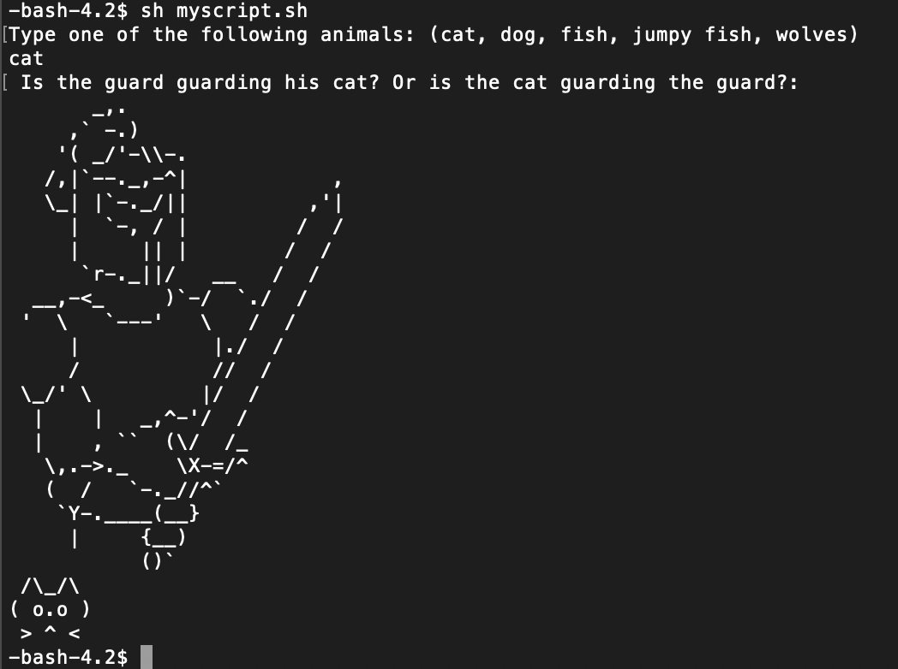
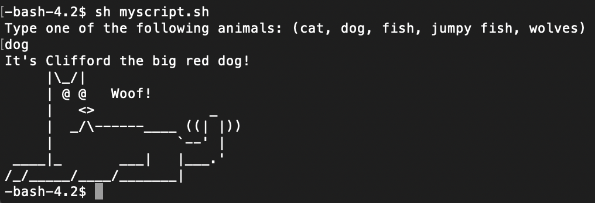
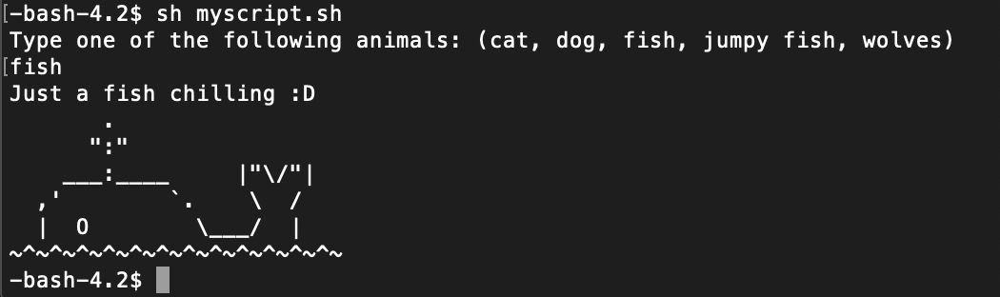
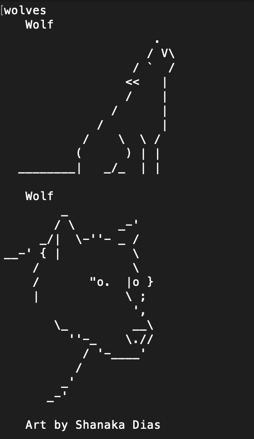
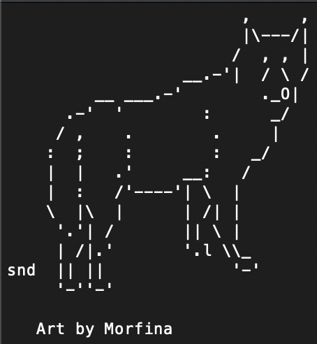
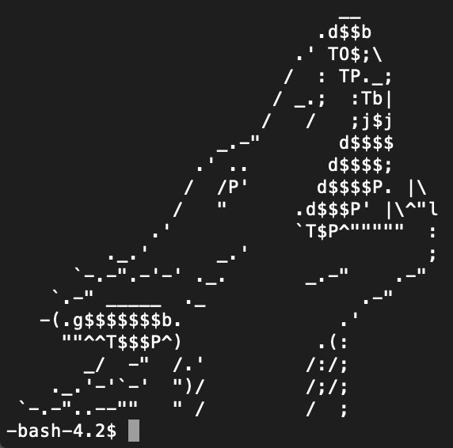

# ASCIIAnimator
Produces the desired ASCII image or animation by user input. The program scraps information from an [ASCII archive](https://www.asciiart.eu/).

## Project Summary
ASCIIAnimator displays image or animation desired by the user. Options include cat with a soldier, dog, fish, wolves, and an animation of a whale moving its tail.

#### Whale

#### Cat

#### Dog

#### Fish

#### Wolves

